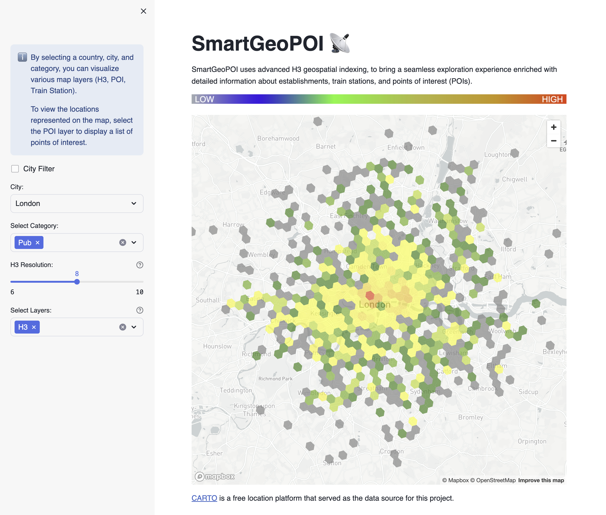

# SmartGeoPOI

SmartGeoPOI utilizes advanced H3 geospatial indexing to deliver a seamless exploration experience enriched with detailed information about establishments, train stations, and points of interest (POIs).

## App Layout

The app features an intuitive sidebar for filtering and visualizing different layers on the map. Below is an example showcasing the app in action for the United Kingdom.

## App Data Requirements

To operate effectively, SmartGeoPOI relies on the following data products from the Snowflake marketplace (How to install them [here](https://other-docs.snowflake.com/en/native-apps/consumer-installing).):

- [Overture Maps - Places](https://app.snowflake.com/marketplace/listing/GZT0Z4CM1E9KR/carto-overture-maps-places)

### Streamlit Setup

When [setting up a new Streamlit App](https://docs.snowflake.com/en/developer-guide/streamlit/create-streamlit-ui), Snowflake automatically creates a new stage for the app. Follow these steps to access and manage your app's stage:

1. **Accessing the Stage**

   Navigate to the Data section on the left side of the screen. Go to Databases and locate the database associated with your Streamlit App (e.g., `SAMPLEDATABASE.PUBLIC`).

   

2. **Selecting the Database and Schema**

   Choose the appropriate database and then select the schema where your Streamlit App resides (e.g., public).

   

3. **Viewing Stages**

   Navigate to Stages to find the automatically generated stage with a unique name.

   

4. **Enabling Directory Listing**

   Click on the stage name. Initially, you will be prompted to "Enable Directory Listing". Click on the button to proceed.

   

5. **Choosing a Warehouse**

   Select a warehouse that will process data for your Streamlit App.

   

6. **Uploading Files**

   Click on "+ Files" in the upper right corner to open a popup for uploading necessary files. Refer to the [official documentation](https://docs.snowflake.com/en/user-guide/data-load-local-file-system-stage-ui) for details on file uploads.

   

7. **Managing Files**

   Upload files by clicking the "Upload" button. Note that files with identical names will overwrite existing ones in the stage.

   

8. **Completing Upload**

   Ensure that essential folders like "utils" and "assets" are uploaded for your Streamlit App.

With these steps, you have successfully managed the stage for your Streamlit App, enabling you to upload and manage files effectively.
